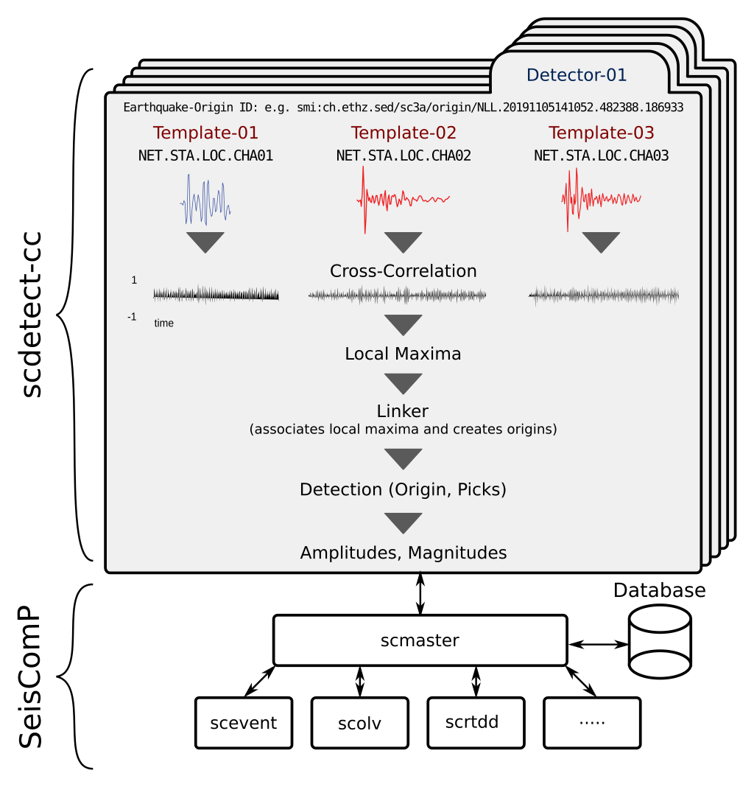
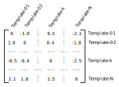

.. _theoretical-background-label:

Theoretical Background
======================

.. _theory-earthquake-detection-label:

Earthquake detection
--------------------

``scdetect-cc`` allows to configure multiple detectors by means of the
:ref:`template configuration <template-configuration-label>`. Detectors are
handled completely independently. The most important properties of the detector
configuration are the (template) earthquake ``"originId"`` and a set of
template waveforms. Again, these template waveforms may be configured
individually with so-called :ref:`stream configuration parameters
<stream-configuration-parameters-label>`.

Once ``scdetect-cc`` has successfully initialized the configured detectors it is
ready for processing. The waveform data to be processed is dispatched
record-wise to the individual detectors, optionally pre-processed (e.g.
resampled, filtered, etc.) and cross-correlated. The cross-correlation
algorithm itself is based on computing the `Pearson Correlation Coefficient
<https://en.wikipedia.org/wiki/Pearson_correlation_coefficient>`_
. The results of the cross-correlation are time series of Pearson correlation
coefficients, i.e. one time series per previously configured template waveform.
During the next processing step the local maxima are extracted. By now, the
processing for each template waveform was completely independent. That changes
during the *linkage phase*. The local maxima are fed to the detector's linker
whose main task is to associate these tuples (time, correlation coefficient).
In fact, these tuples already correspond to potential picks. During the
association process the linker maintains a set of *detection candidate*\s. For
each detection candidate a score is computed that is the arithmetic mean of
the correlation coefficients from the associated picks. Once the score of a
detection candidate exceeds the configured ``"triggerOnThreshold"`` the linker
emits the detection candidate. In case a ``"triggerDuration"`` was configured the
detection candidate still is put on hold i.e. it might be overridden by a
detection candidate with both a higher score and at least the same number of
associated picks. This approach guarantees that within the
``"triggerDuration"`` configured only the *best* candidate is emitted until
either the time from the ``"triggerDuration"`` is passed by or the score of
subsequently emitted detection candidates falls below the configured
``"triggerOffThreshold"``. Without a ``"triggerDuration"`` enabled every
detection candidate immediately qualifies to a detection.

Further processing of the detection involves to optionally compute so-called
*template arrivals* i.e. arrivals which are part of the :external:term:`origin`
identified by the template earthquake ``"originId"``, but not used for
detection. The detection's coordinates and depth are those of the template
earthquake.

Depending on the configuration ``scdetect-cc`` subsequently computes amplitudes
and magnitudes.

Finally, the detection (in terms of SeisComP this corresponds to a new origin),
picks, amplitudes and magnitudes are send to :external:ref:`scmaster` and may
be used for further processing with other SeisComP modules.

.. _theory-phase-association-label:

Phase association
-----------------

.. note::

  Phase association is only relevant if a detector is configured with at least
  two template waveforms.

Each detector comes with its dedicated linker which is responsible for phase
association. The linker continuously consumes local maxima and performs the
association based on template arrival times and a configurable
``"arrivalOffsetThreshold"``.

Given a detector is configured with ``N`` template waveforms. Then, the
template arrival times form a *reference matrix* such as e.g.

The entry of the ``i-th`` row and ``j-th`` column corresponds to the difference
between the arrival referring to ``Template-i`` and the arrival referring to
``Template-j``. Therefore, the diagonal elements are all zero.

Based on this information the linker maintains a list of detection candidates
where each candiate has its own *association matrix*. During operation the
linker constantly tries to insert new local maxima into the association
matrices. A local maxima referring to ``Template-k`` is inserted if the absolute
values of all the differences in either the ``k-th`` row or the ``k-th`` column
between the entries of the reference matrix and the association matrix are
smaller than or equal to the configured ``"arrivalOffsetThreshold"``. Once a
association matrix is *complete* the candidat's score is computed that is the
arithmetic mean from the correlation coefficients of the associated local
maxima. If the score is greater than or equal to the configured
``"triggerOnThreshold"`` the detection candidate is emitted.

   The linker maintains a list of detection candidates where each candidate
   has its own association matrix. Missing entries are indicated with a ``-``.

Changing the ``"minimumArrivals"`` to a value smaller than ``N`` allows the
user to influence the completeness of an association matrix. I.e. in fact a
detection candidate is emitted once both the candidate's score exceeds the
``"triggerOnThreshold"`` and the number of associated local maxima is at least
equal to the value specified by the ``"minimumArrivals"`` configuration
parameter.

.. _theory-amplitude-calculation-label:

Amplitude calculation
---------------------

Computing amplitudes is a prerequisite in order to perform a magnitude
estimation later on. Since multiple magnitude estimation methods are provided,
each magnitude estimation method requires to compute a corresponding amplitude
type. In accordance with the magnitudes methods described in
the :ref:`magnitude estimation <theory-magnitude-estimation-label>` section ``scdetect-cc``
implements the following amplitude types to be computed:

* 
  ``MRelative``\ : Amplitude computed as the ratio between the template waveform and
  the detection. The approach is outlined by e.g. :cite:t:`peng2009` and
  :cite:t:`ross2017` and uses the same instrument components as specified by
  the detector configuration.

* 
  ``MLx``\ : Amplitudes required for the *amplitude-magnitude regression* approach.
  The implementation follows the approach outlined
  in :cite:t:`herrmann2019` (section 3.3.3 *Magnitude Estimation*\ )
  . Amplitudes used for the amplitude-magnitude regression are so called *sensor
  location* `RMS (root-mean-square) <https://en.wikipedia.org/wiki/Root_mean_square>`_
  *amplitudes* (i.e. the maximum sample-wise RMS regarding the horizontal
  components for a certain sensor location w.r.t. velocity seismograms).

Amplitudes are calculated once an :external:term:`origin` has been declared.

In general, the computation of amplitudes is sensor location dependent. In order
to provide dedicated configuration for different sensor locations ``scdetect-cc``
makes use of
SeisComP's :external:ref:`bindings configuration <global_bindings_config>`
concept. Note that amplitudes are calculated only:

* for those sensor locations with bindings configuration available,
* if the internal waveform buffer still contains the required time window.

The waveform buffer size may be configured using
the ``processing.waveformBufferSize`` module configuration parameter.

.. _theory-magnitude-estimation-label:

Magnitude estimation
--------------------

``scdetect-cc`` estimates magnitudes as so called SeisComP *station magnitudes* (
for further details, please refer to the :external:ref:`scmag documentation <scmag>`)
. Magnitudes may be estimated for only those sensor locations, the corresponding
magnitude types were computed, previously. In accordance with the amplitude
types described in the :ref:`amplitude calculation section <theory-amplitude-calculation-label>`,
the following magnitude types are available:

* 
  ``MRelative``\ : Template-detection ratio based magnitude estimation. Besides, of
  the corresponding amplitudes to be computed, this particular type requires
  station magnitudes to be available
  through :ref:`EventParameters <inventory-events-and-configuration-label>`.
  For further details please refer to either :cite:t:`peng2009` or
  :cite:t:`ross2017`.

* 
  ``MLx``\ : Amplitude-magnitude regression based magnitude type. Besides, of the
  corresponding amplitudes to be computed, this particular type requires both
  amplitudes and station magnitudes to be available by means
  of :ref:`EventParameters <inventory-events-and-configuration-label>`. Moreover, the
  approach is based on so-called *template families* which in fact are groups of
  *related* templates. The
  corresponding :ref:`template family configuration <template-family-configuration-label>`
  must be provided by ``scdetect-cc``\ '
  s ``--templates-family-json path/to/templates-family.json`` CLI flag. For
  further information please refer to :cite:t:`herrmann2019` (section 3.3.3
  *Magnitude Estimation*).

All magnitude estimation methods listed above are based on the following types
of *template station magnitudes*\ :

* 
  ``MLh``: please refer to the :ref:`SeisComP documentation <global_mlh>`

* 
  ``MLhc``\ : based on ``MLh``\ , but uses a slightly adjusted relationship (i.e.
  corrected for near-field observations) and allows for station specific
  corrections.

.. note::

   Magnitudes of type ``MLhc`` are preferred over magnitudes of type ``MLh``.

Recall, that template station magnitudes must be available through
EventParameters (for further details, please refer to the related :ref:`section
<inventory-events-and-configuration-label>` on providing these data products).

