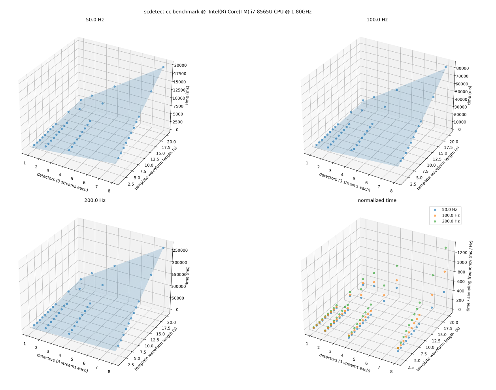

# scdetect-cc benchmarking

This manual describes how to run the `scdetect-cc` application benchmarks and
how to interpret the results.

`scdetect-cc` application benchmarks are focused towards so called
*Three-Stream-Detectors* (AKA station detectors) under the consideration of
different sampling frequencies (i.e. 50 Hz, 100 Hz and 200 Hz) and different
template waveform lengths (i.e. from 2 s to 20 s). Particularly, it is both the
cross-correlation performance and the detection performance which is measured.

## Generating required data

A `Makefile` is prepared in order to generate the benchmark data. Invoke the
machinery with e.g.

```
$ export BUILD_DIR=~/work/projects/seiscomp/build
$ export SEISCOMP_ROOT=~/seiscomp
$ make config
```

where `BUILD_DIR` is
the [CMake project build directory](https://cmake.org/cmake/help/latest/manual/cmake.1.html)
. Setting this variable is required since `scdetect-cc` application benchmark
suite related utilities are build, only (i.e. not installed).

## Running the benchmarks

In order to run benchmarks simply make use of the benchmarking driver script
`perf.py`, e.g.:

```bash
$ ./perf.py --plot --data-size 30 --estimate-overload-capacity \
  ${BUILD_DIR}/bin/perf_scdetect_cc_app data/app/
```

Besides, from timing `scdetect-cc`'s cross-correlation and detection performance
data may be visualized. Additionally, the so-called *real-time overload
capacity* may be estimated (i.e. based on the modelled results and the data fed)
.

## Example

<p align="center">
  
</p>

The graphics above display the benchmark results including the models. For this
example the resulting real-time overload capacity estimation results are:

```csv
=== Station detector report - real-time overload capacity estimation ===
sampling frequency (Hz),length_template_waveform (s),num_detectors
50.0,4,2321
50.0,8,1503
50.0,12,1111
100.0,4,713
100.0,8,431
100.0,12,298
200.0,4,260
200.0,8,137
200.0,12,93
```

Note that `num_detectors` refers to the estimated maximum number of
Three-Stream-Detectors which could be configured without overloading the
application. Though, these results should be interpreted carefully. In order to
stay on the safe side it is recommended not to configure more than `2/3` of the
number of detectors estimated. This is due to the fact that benchmarks reflect a
simplified configuration scenario which does not necessarily describe a
production configuration. For further information, please also refer to section
on [benchmark limitations](#limitations).

## Limitations

At the time being, `scdetect-cc` application benchmarks do not cover:

- the linker performance characteristics in case of a lower
  `"triggerOnThreshold"`s. Note that benchmarking results are based on
  a `"triggerOnThreshold"` of 0.7.
- the linker performance characteristics in case of more (i.e. > 3)
  streams to be associated.
- the overall application performance characteristics in case of higher sampling
  frequencies (e.g. in the kHz and MHz range)
- the application performance characteristics in case of amplitude / magnitude
  calculation enabled.